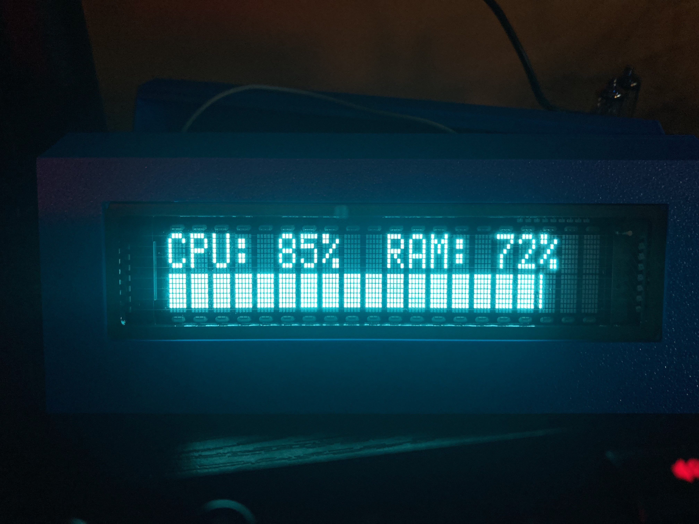

# P1140 - 2x20 VFD Display Enclosure+Driver

This project is my enclosure, Pico code, and PC software for a
CU20029-UW1J Vacuum Fluorescent Display I got a hold of.

# BOM
- CU20029-UW1J VFD Display
- Raspberry PI Pico, Original
- 13x Female-Female Jumpers, ~3in
- 3D printed parts from this project, C1141 to C1143

## Wiring

The following is the wiring between the Pico and the display:

|---------|------------|
| Pico IO | Display IO |
|---------|------------|
| 0       | DB0        |
| 1       | DB1        |
| 2       | DB2        |
| 3       | DB3        |
| 4       | DB4        |
| 5       | DB5        |
| 6       | DB6        |
| 7       | DB7        |
| 8       | E          |
| 9       | RW         |
| 10      | RS         |
|---------|------------|

# Parts
- C1141 Rev A: Enclosure, front
- C1142 Rev A: Enclosure, back
- C1143 Rev A: Enclosure, Pico Holders
- F1145 Rev A-dev: PI Pico Firmware
- S1146 Rev A-dev: Python PC Software, multiple

# License

This entire project is licensed under [GPLv3](LICENSE.md)
